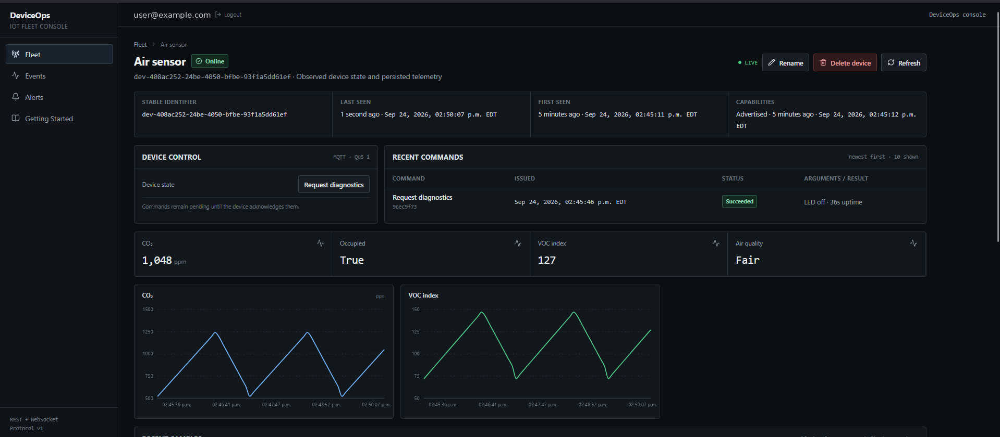

# DeviceOps

DeviceOps is an IoT fleet management and observability platform that connects
compatible devices through a versioned MQTT protocol, persists and evaluates
their data in FastAPI and PostgreSQL, and exposes a realtime Next.js operations
console.

Devices publish signed capability manifests describing their scalar telemetry
and supported controls. The console uses those manifests to render the relevant
values, charts, table columns, alert choices, and protocol-v1 controls without
being hard-coded to a particular sensor.

- [Live site](https://deviceops.net)
- [About DeviceOps](https://deviceops.net/about)
- [Run DeviceOps](#run-deviceops)
- [MQTT protocol v1](contracts/mqtt.md)



_The production Air Sensor publishes only capability-defined CO₂, VOC index,
occupancy, and air-quality telemetry._

## System design

The browser never connects directly to MQTT. FastAPI authenticates device
traffic, commits accepted state to PostgreSQL, and only then publishes
owner-scoped updates to the web console.

```text
Device / simulator -> MQTT broker -> FastAPI -> PostgreSQL
                                        |
Browser <- REST snapshots and history --+
        <- authenticated WebSocket deltas
```

Commands follow a deliberately closed loop:

```text
Next.js -> REST -> FastAPI -> MQTT -> Device
Browser <- WebSocket <- FastAPI <- MQTT acknowledgement
```

A command remains `pending` until the device returns a valid acknowledgement;
only that committed acknowledgement can mark it `succeeded` or `failed`.

### Production deployment

| Responsibility                     | Deployment                                               |
| ---------------------------------- | -------------------------------------------------------- |
| Next.js frontend and custom domain | Vercel at [deviceops.net](https://deviceops.net)         |
| FastAPI backend                    | Fly.io                                                   |
| PostgreSQL                         | Supabase                                                 |
| MQTT broker                        | HiveMQ Cloud with broker authentication and verified TLS |

Local development uses Docker Compose, PostgreSQL, and Eclipse Mosquitto. The
repository's anonymous plaintext Mosquitto listener is intentionally local-only
infrastructure and is not the production broker.

## Implemented features

- User registration and login with Argon2 password hashing and JWT access
  tokens, plus per-user device ownership.
- One-time device registration secrets and per-device HMAC-signed MQTT
  envelopes with boot/process session isolation.
- Production MQTT broker authentication and verified TLS, retained signed
  online/offline presence, and retained signed capability manifests.
- Capability-driven scalar telemetry, including generated metric cards,
  numeric charts, recent-sample columns, and numeric alert choices.
- A fixed protocol-v1 command vocabulary, acknowledgement-controlled command
  state, and persistent command history.
- Authenticated WebSocket updates for telemetry, presence, capabilities,
  commands, events, and alert lifecycles.
- Persistent fleet Events plus metric-threshold and offline-duration alert
  rules.
- Three-day rolling telemetry and Event retention.
- Optional friendly device names and owner-confirmed permanent deletion.
- Python simulator profiles and a verified ESP32-S3 + BME280 reference
  implementation.

## Capability-driven device model

A compatible DeviceOps v1 implementation publishes a signed, retained
capability manifest. Telemetry descriptors support four scalar value types:

- `number`
- `integer`
- `boolean`
- `string`

The UI consumes each descriptor's label, unit, type, and manifest order
generically. Numeric and integer metrics can receive charts and numeric
threshold alert rules. Boolean and string metrics remain visible as values and
table columns without being treated as numeric data.

The `air-quality` simulator profile demonstrates the abstraction by publishing
only `co2_ppm`, `voc_index`, `occupied`, and `air_quality`. It publishes none of
the historical BME-style first-class metric names.

Other capable devices can integrate by implementing the documented
[DeviceOps MQTT v1 protocol](contracts/mqtt.md); compatibility is protocol-based
rather than automatic. The Python simulator and
ESP32-S3 + BME280 firmware are the verified implementations in this repository.

## Run DeviceOps

### Path A: Python simulator

The simulator is the quickest software-only route and requires no hardware.
Start the local stack, register a device through the local web console, save its
one-time secret, and run the simulator with the generated device ID. Profiles
include `default`, `portable-sensor`, and `air-quality`.

See the [simulator guide](simulator/README.md) for installation, profile, local
MQTT, and optional TLS configuration.

### Path B: ESP32-S3 reference hardware

The verified physical implementation uses an ESP32-S3, a BME280 environmental
sensor, and the board's WS2812 LED. It demonstrates the same signed protocol,
presence, capabilities, telemetry, commands, and acknowledgements as the
simulator; it is one implementation, not a platform requirement.

See the [firmware guide](firmware/esp32/README.md) for wiring, PlatformIO setup,
build, upload, and local credential configuration.

Production HiveMQ credentials are operator-managed secrets and are not supplied
to public repository visitors. The Docker Compose/Mosquitto path is the public,
reproducible development environment; the hosted site demonstrates the separate
production architecture.

## Local development

The detailed guides remain authoritative, but the basic sequence is:

1. Start PostgreSQL and local Mosquitto with `docker compose up -d`.
2. Create the backend virtual environment and install `apps/api`.
3. Run `python -m alembic upgrade head` from `apps/api`.
4. Start FastAPI with `python -m uvicorn deviceops_api.main:app --host 127.0.0.1 --port 8000`.
5. Install and start the web console with `npm install` and `npm run dev` from `apps/web`.
6. Register or sign in at <http://localhost:3000>, then create a device.
7. Run a simulator profile with the returned device ID and one-time secret.

Complete setup and configuration:

- [Backend and database](apps/api/README.md)
- [Web console](apps/web/README.md)
- [Python simulator](simulator/README.md)
- [ESP32 reference firmware](firmware/esp32/README.md)
- [MQTT protocol contract](contracts/mqtt.md)

## Repository structure

| Path                 | Purpose                                                                                   |
| -------------------- | ----------------------------------------------------------------------------------------- |
| `apps/api`           | FastAPI REST/WebSocket service, MQTT ingestion, alerts, retention, and Alembic migrations |
| `apps/web`           | Next.js public site and authenticated operations console                                  |
| `contracts`          | Versioned MQTT topic and payload contract                                                 |
| `firmware/esp32`     | Verified ESP32-S3 + BME280 PlatformIO implementation                                      |
| `simulator`          | Python device simulator and selectable capability profiles                                |
| `infra/mosquitto`    | Local-development Mosquitto configuration                                                 |
| `docker-compose.yml` | Local PostgreSQL and Mosquitto services                                                   |

## Intentional boundaries

- Protocol v1 supports scalar telemetry, not arbitrary binary, image, audio,
  video, array, or structured visualization payloads.
- Commands use a fixed protocol vocabulary rather than device-defined arbitrary
  executable operations.
- External email, SMS, push, and webhook alert delivery is not implemented.
- OTA firmware updates are not implemented.
- One API process currently owns MQTT ingestion, realtime delivery, offline-rule
  evaluation, and retention cleanup. Horizontal multi-worker scaling would
  require separating or coordinating those responsibilities.
- HMAC and session validation protect message integrity and normal stale-session
  ordering, but protocol v1 does not provide complete anti-replay protection.
